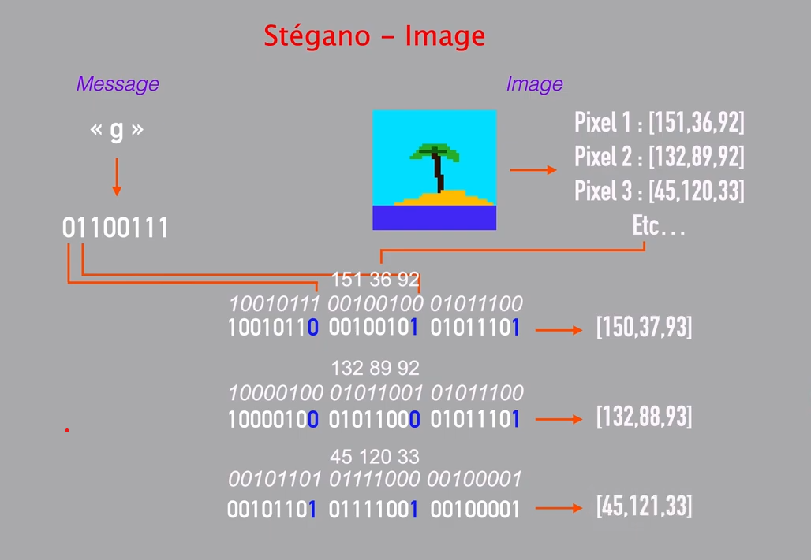

<h2 align="center">Steganographie</h2>

Ceci est une application qui a pour but de cacher un texte dans une image: 
Le principe est illustrer comme suit:

### Caracteristiques
- Chaque lettre est encodee sur 8 bits
- La taille du message en bits est encodee sur 16bits
- Les 16 premiers bits lu de l'image contiendrons la taille du message
- En encodant la taille sur 16 bits on a la possibilite de cacher 2kbits de donnees dans une image